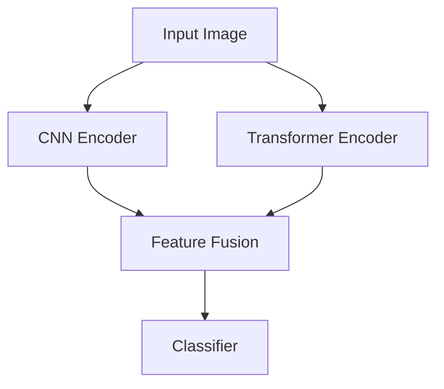
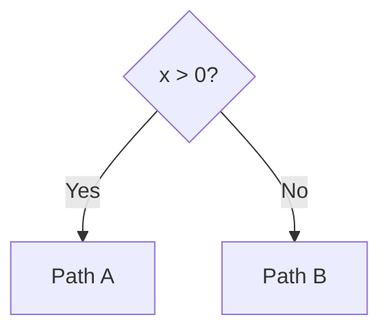

# Vi-Graph
## Vision-Language Diagram Understanding, Graph Reconstruction, and Multimodal Reasoning

> **Project goal:** Build a lightweight but research-oriented multimodal system that takes a diagram image, reconstructs its structure as a machine-readable graph, renders an editable diagram, and answers questions about the diagram.
>
> **Primary research question:** How accurately can compact Vision-Language Models (VLMs) recover the structural relationships represented in visual diagrams, especially as diagram complexity increases?

**Repo / package name:** `vigraph` (lowercase, no space — used in code, paths, imports). **Display name:** Vi-Graph.

**Build target:** this spec is written to be handed to Claude Code as the implementation agent. **Training target:** Google Colab (T4), as a separate track from app development.

---

# Changelog — What Changed From v1

This version patches nine gaps identified in review. If you already have v1 in progress, here's what's different:

1. **Node/edge matching algorithm added** (§20.1) — v1 defined precision/recall/F1 but never said how a predicted node maps to a ground-truth node. This was a blocking gap; nothing in §20 was actually computable without it.
2. **Schema extended** (§7) — added `edge.label`, `edge.condition`, a `group_id`/`parent_id` field for nested nodes, and a `schema_version` field. Relation vocabulary expanded beyond `flows_to`.
3. **Invalid-output repair path defined** (§8, Stage C) — retry-with-correction policy instead of silent rejection.
4. **QA routing logic specified** (§12.1) — a concrete decision procedure for graph-only vs. VLM-assisted answering, instead of an unspecified "use VLM only when needed."
5. **Non-VLM baseline added** (§19, §24) — OCR + rule-based geometry baseline, to justify why a VLM is necessary at all.
6. **Research-rigor additions** (§20.11–20.13) — inter-annotator agreement, run-to-run variance across seeds, statistical significance treatment for model comparisons.
7. **Reproducibility/logging section added** (§18.1) — decoding parameters, prompt versioning, seed logging.
8. **Nested/grouped structure support** — schema (§7) and graph functions (§9) now handle containment, not just the `contains` relation label.
9. **Time estimates added per phase** (§31).

Plus two additions requested directly: a short section on building this with Claude Code (§33), and confirmation that Colab T4 remains the training environment throughout (§18).

## v3 additions

10. **§33 expanded for a single continuous Claude Code session** — `CLAUDE.md` is now specified as a living status file (not just static conventions), commit granularity guidance is added, and Phase 6 (Colab training) is explicitly flagged as the one phase Claude Code can't run for you inside the session.
11. **§44 added — GitHub Repository Presentation** — badge guidance (achievement badges vs. README badges), what to add and when, kept separate from the technical spec so it doesn't get lost.

---

# 1. Project Summary

Vi-Graph converts a visual diagram into a structured representation.

### Input

The user uploads an image containing a:

- Neural network architecture
- ML/CV pipeline
- Flowchart
- Software/system architecture
- Data pipeline
- Scientific workflow
- UML-like diagram
- Research-paper architecture figure

### Core pipeline

```text
Diagram Image
     |
     v
Vision-Language Model
     |
     v
Structured JSON
(nodes + edges + labels + metadata)
     |
     v
Graph Validation / Normalization / Repair
     |
     v
Interactive Graph
     |
     +----> Mermaid
     +----> SVG / PNG / PDF
     +----> JSON
     |
     v
Topology-aware Question Answering
```

The system should not stop at image captioning. It should recover **structure**.

---

# 2. Why This Project

A generic multimodal chatbot can answer:

> "This is a CNN architecture."

Vi-Graph should answer:

> "The input branches into the CNN Encoder and Transformer Encoder. Their outputs are combined at Feature Fusion, which feeds the Classifier."

The distinction is:

```text
Image Description
        vs.
Structural Understanding
```

The research contribution is centered on measuring the second one — and, now, on showing that a VLM is actually *needed* to get it (see §19, non-VLM baseline).

---

# 3. Main Objectives

## MVP Objectives

1. Upload a diagram image.
2. Run a VLM.
3. Extract nodes and directed edges.
4. Return a strict, versioned JSON graph.
5. Render the graph as Mermaid.
6. Display an interactive editable graph.
7. Let the user ask basic questions about the reconstructed structure.
8. Export Mermaid, SVG, PNG, PDF, and JSON.

## Research Objectives

1. Build a synthetic + real diagram benchmark.
2. Define graph-based evaluation metrics, including a documented node/edge matching procedure.
3. Compare multiple VLMs and model sizes, **plus a non-VLM baseline**.
4. Fine-tune a compact model using a Colab T4.
5. Test robustness under increasing diagram complexity.
6. Analyze structural failure modes using a fixed error taxonomy.
7. Produce reproducible experiments (fixed seeds, logged decoding parameters, versioned prompts) and a research report/paper.

---

# 4. Important Design Principle

## Do NOT train a giant VLM from scratch.

Use an existing multimodal model and focus compute on:

- inference
- parameter-efficient fine-tuning
- evaluation
- dataset generation

The Colab T4 is sufficient for the research direction when model size, quantization, sequence length, image resolution, and LoRA configuration are chosen carefully. **Training happens exclusively in Colab** — the backend never trains, it only loads a saved adapter (see §18).

The first MVP should work **before fine-tuning**.

---

# 5. Proposed Project Structure

```text
vigraph/
│
├── README.md
├── CLAUDE.md                 # context/conventions for Claude Code — see §33
├── LICENSE
├── requirements.txt
├── .env.example
├── docker-compose.yml
│
├── frontend/
│   ├── app/
│   ├── components/
│   ├── lib/
│   └── public/
│
├── backend/
│   ├── app/
│   │   ├── main.py
│   │   ├── config.py
│   │   ├── schemas/           # Pydantic models, schema_version pinned here
│   │   ├── api/
│   │   ├── vlm/                # thin interface — swappable model backend
│   │   ├── graph/
│   │   ├── qa/                 # includes routing logic, §12.1
│   │   ├── exporters/
│   │   └── utils/
│   └── tests/
│
├── data/
│   ├── raw/
│   ├── synthetic/
│   ├── real/
│   ├── annotations/            # includes inter-annotator agreement records
│   ├── splits/
│   └── README.md
│
├── training/                   # Colab notebooks + configs — see §18
│   ├── configs/
│   ├── scripts/
│   ├── notebooks/
│   └── README.md
│
├── evaluation/
│   ├── scripts/
│   ├── metrics/                # includes matching.py — §20.1
│   ├── reports/
│   └── notebooks/
│
├── research/
│   ├── experiment_matrix.md
│   ├── error_taxonomy.md
│   └── paper/
│
└── examples/
    ├── diagrams/
    └── outputs/
```

---

# 6. Technology Stack

## Frontend

Recommended:

- Next.js
- React
- TypeScript
- Tailwind CSS
- React Flow for interactive graph editing (supports grouped/nested nodes — needed for §7's `group_id`)
- Mermaid for Mermaid source/rendering

The frontend should be clean and lightweight.

## Backend

Recommended:

- Python
- FastAPI
- Pydantic
- PyTorch
- Transformers
- Pillow
- NetworkX
- `scipy.optimize.linear_sum_assignment` (Hungarian algorithm, for node matching — §20.1)
- `rapidfuzz` or similar (fast string similarity for label matching)

Optional:

- Graphviz
- OpenCV (also used for the non-VLM baseline, §19)

## Model Layer

Use a compact VLM as the starting model.

Candidate family:

- Qwen-VL / Qwen3-VL compatible instruct models
- Other compact open VLMs may be added for comparison

Start with one model for the MVP. Then add several model families for research comparison, **plus one non-VLM baseline** (§19).

## Storage

Start with:

- SQLite for experiments and metadata
- Local filesystem for uploaded images/results

Cloud/object storage can be added later.

---

# 7. Canonical Graph Schema

This schema is one of the most important parts of the project. **v2 changes from v1 are marked.**

The VLM should produce structured JSON, NOT free-form prose.

```json
{
  "schema_version": "2.0",
  "diagram_type": "neural_network",
  "nodes": [
    {
      "id": "n1",
      "label": "Input Image",
      "type": "input",
      "group_id": null
    },
    {
      "id": "n2",
      "label": "CNN Encoder",
      "type": "module",
      "group_id": null
    },
    {
      "id": "n3",
      "label": "Transformer Encoder",
      "type": "module",
      "group_id": null
    },
    {
      "id": "n4",
      "label": "Feature Fusion",
      "type": "fusion",
      "group_id": null
    },
    {
      "id": "n5",
      "label": "Classifier",
      "type": "output",
      "group_id": null
    }
  ],
  "edges": [
    {
      "source": "n1",
      "target": "n2",
      "relation": "flows_to",
      "label": null,
      "condition": null
    },
    {
      "source": "n1",
      "target": "n3",
      "relation": "flows_to",
      "label": null,
      "condition": null
    },
    {
      "source": "n2",
      "target": "n4",
      "relation": "flows_to",
      "label": null,
      "condition": null
    },
    {
      "source": "n3",
      "target": "n4",
      "relation": "flows_to",
      "label": null,
      "condition": null
    },
    {
      "source": "n4",
      "target": "n5",
      "relation": "flows_to",
      "label": null,
      "condition": null
    }
  ]
}
```

## 7.1 What changed vs. v1

- **`schema_version`** — every graph is tagged with the schema version it was produced under. Non-negotiable for reproducibility once the schema evolves mid-project.
- **`node.group_id`** — optional. Lets a node declare it belongs to a parent/container node (e.g., three ops nested inside a "ResNet Block"). `null` for ungrouped nodes. A group is itself just a node with `type: "group"` — no separate schema needed.
- **`edge.label`** — optional free-text label attached to an edge. Needed for flowchart decision branches ("Yes" / "No" off a diamond) which v1's schema had no field for.
- **`edge.condition`** — optional, more structured than `label`, for cases like `"x > 0"`. Can stay unused in the MVP; reserved so flowchart support doesn't require another schema migration later.
- **Expanded relation vocabulary** (see below) — v1's four relations (`flows_to | contains | branches_to | merges_to | unknown`) don't cover UML semantics.

## 7.2 Relation vocabulary

```text
flows_to        — default control/data flow
contains        — structural containment (superseded in most cases by group_id,
                   kept for cases where containment is asserted without a
                   visual boundary)
branches_to     — one-to-many split
merges_to       — many-to-one join
inherits_from   — UML generalization
composes        — UML composition
aggregates      — UML aggregation
depends_on      — UML/architecture dependency
unknown         — relation present but type unclear from the image
```

Diagram types that don't need the UML relations simply won't produce them — this is additive, not a burden on the neural-network/flowchart cases.

## 7.3 Optional node metadata

Later add:

```json
{
  "id": "n2",
  "label": "CNN Encoder",
  "type": "module",
  "group_id": null,
  "bbox": [120, 240, 310, 350],
  "confidence": 0.94
}
```

The bounding box is useful for debugging and visualization but should not be mandatory for the MVP. If `confidence` is populated, log it — it becomes useful later for a calibration check (does a high-confidence node actually get matched more often in evaluation?), even though that's not a required MVP metric.

---

# 8. Diagram Understanding Pipeline

## Stage A: Image preprocessing

Before VLM inference:

1. Load image.
2. Convert to RGB.
3. Check dimensions.
4. Resize only when necessary.
5. Preserve aspect ratio.
6. Optionally create a high-resolution crop for dense diagrams.

Do not aggressively resize small text out of existence.

## Stage B: VLM prompt

The prompt should force structured output, and must declare the schema version it's targeting.

```text
You are a diagram understanding system.

Analyze the provided diagram and reconstruct its structure.

Return ONLY valid JSON using schema_version "2.0":

{
  "schema_version": "2.0",
  "diagram_type": "...",
  "nodes": [
    {
      "id": "...",
      "label": "...",
      "type": "input|module|operation|decision|fusion|output|group|unknown",
      "group_id": "... or null"
    }
  ],
  "edges": [
    {
      "source": "...",
      "target": "...",
      "relation": "flows_to|contains|branches_to|merges_to|inherits_from|composes|aggregates|depends_on|unknown",
      "label": "... or null",
      "condition": "... or null"
    }
  ]
}

Requirements:
- Include every clearly visible component.
- Preserve exact visible labels whenever possible.
- Infer an edge only when the visual evidence supports it.
- Do not invent nodes that are not visible.
- Use unique node IDs.
- Every edge must reference existing node IDs.
- If a node is visually nested inside another (a box inside a box, a
  labeled cluster), set its group_id to the containing node's id.
- If an edge has a visible text label (e.g. "Yes"/"No" on a decision
  branch), populate edge.label with that exact text.
- Return JSON only.
```

**Reproducibility requirement:** every inference call logs the exact prompt version (hash or version string), model name/checkpoint, and decoding parameters used (§18.1). This is required starting from the MVP, not added later — it's cheap to log from day one and expensive to reconstruct retroactively.

## Stage C: JSON validation and repair

Use Pydantic.

Reject on first pass:

- Invalid JSON
- Missing nodes
- Edges referencing nonexistent nodes
- Duplicate node IDs
- Empty labels where a visible label exists
- `group_id` referencing a nonexistent node
- Unknown `schema_version`

**What happens after rejection (v1 left this undefined):**

1. On failure, retry once with a corrective follow-up prompt that includes the specific validation error (e.g., "edge `n3->n9` references a node ID that doesn't exist — return corrected JSON").
2. If the second attempt still fails, attempt a lightweight programmatic repair: drop edges referencing missing nodes, drop the offending duplicate, keep everything else that validates. Mark the resulting graph as `repaired: true` with a list of what was dropped/fixed.
3. If repair still can't produce a valid graph, return a structured failure to the user/experiment log — never silently substitute an empty graph without flagging it.
4. **Every one of the above outcomes is logged.** JSON Validity Rate (§20.4) should be reported both as "valid on first attempt" and "valid after retry/repair" — these are different and both matter.

## Stage D: normalization

Normalize:

- whitespace
- duplicated labels
- node IDs
- edge direction
- relation names

Do not silently "fix" a structurally uncertain prediction without recording that correction (same principle as Stage C — corrections are logged, not silent).

---

# 9. Graph Construction

After JSON validation:

```text
JSON
 |
 v
NetworkX Graph (group_id encoded as a node attribute / optional
                 compound-graph representation)
 |
 +--> topology analysis
 +--> Mermaid generation
 +--> QA
 +--> evaluation
```

Functions should include:

```python
build_graph()
validate_graph()
find_predecessors()
find_successors()
find_parallel_branches()
find_paths()
find_sources()
find_sinks()
find_group_members(group_id)      # new — needed for §7's group_id
flatten_groups()                  # new — collapse nested structure to a
                                   # flat graph when a consumer (e.g. Mermaid)
                                   # doesn't support nesting
```

---

# 10. Mermaid Generation

Convert the canonical graph into Mermaid.



For a decision edge with a label:



For grouped nodes, use Mermaid's `subgraph` block driven by `group_id`.

Important:

- Escape Mermaid-sensitive characters.
- Generate deterministic node IDs.
- Preserve graph topology exactly.
- Render `edge.label` as Mermaid's `-->|label|` syntax when present.
- Render `group_id` clusters as `subgraph` blocks.
- Never create Mermaid directly from unvalidated free text.

---

# 11. Interactive Editor

Use React Flow or an equivalent graph UI (React Flow supports nested/grouped nodes natively, matching §7).

The user should be able to:

- Move nodes
- Rename nodes
- Add nodes
- Delete nodes
- Add/remove edges
- Edit edge labels
- Change node type
- Group/ungroup nodes
- Inspect node metadata
- Reset to AI reconstruction
- Save edited structure

The graph editor becomes the main visual part of the portfolio demo.

---

# 12. Multimodal Question Answering

Do NOT let QA rely only on another vague image description.

First reconstruct the graph. Then use the graph to answer structural questions.

```text
User:
Which modules operate in parallel?

System:
CNN Encoder and Transformer Encoder operate in parallel
after receiving the Input Image.
```

## 12.1 Routing logic (new — v1 asserted this without specifying how)

Not every question needs the image. A concrete routing procedure:

```text
1. Classify the incoming question into one of:
     - Direct        (e.g. "what comes after X", "how many nodes")
     - Structural     (e.g. "which nodes connect to X", "what paths exist")
     - Comparative     (e.g. "which branch is deeper")
     - Visual/perceptual (e.g. "what color is this box", "is this label
        handwritten") — anything referring to appearance rather than
        topology

2. Direct / Structural / Comparative -> answer purely from the graph
   (NetworkX query). No VLM call needed at answer time.

3. Visual/perceptual -> the graph alone can't answer this; call the VLM
   with the original image + question.

4. Ambiguous / mixed (e.g. "why does the Skip branch connect to
   Addition?") -> answer the topological part from the graph, and only
   fall back to the image if the graph-based answer is insufficient
   (e.g. the question asks for a *reason*, which the graph doesn't encode).
```

The classifier for step 1 can start as a simple keyword/rule-based router (fast, cheap, and good enough for the fixed question categories in §12.2) — an LLM-based classifier is a reasonable v2 upgrade but isn't required for the MVP.

## 12.2 Question categories

### Direct

- What comes after the CNN Encoder?
- What is the final output?
- How many nodes are present?

### Structural

- Which nodes are connected directly to Fusion?
- Which branches operate in parallel?
- What are all paths from Input to Classifier?
- Which nodes have multiple outgoing edges?

### Comparative

- Which branch is deeper?
- Which component receives outputs from both branches?

### Explanation

- Explain the data flow from input to output.
- Explain where the branches merge.

The answer should be grounded in the graph whenever possible, and the UI should show which nodes/edges the answer is grounded in.

---

# 13. Dataset Strategy

Use two data sources.

## A. Synthetic Dataset

This is the most important source for scalable training.

Generate graphs programmatically, then render them into images. Ground truth is automatically known and generated in schema v2 format directly (including `group_id` and `edge.label` where applicable, so the synthetic generator exercises the full schema, not just the v1 subset).

### Synthetic graph patterns

Include:

- Linear
- Branching
- Merging
- Multi-branch
- Fan-in
- Fan-out
- Skip connections
- Residual connections
- Cycles where appropriate
- Nested components (rendered as visually contained boxes — this is what exercises `group_id`)
- Labeled/conditional edges (decision-style Yes/No branches — exercises `edge.label`)
- Long-range arrows

### Visual variations

Randomize: node positions, spacing, fonts, shapes, line thickness, arrow styles, orientation, page size, labels, colors, background, layout type.

Do not make every generated diagram look identical.

---

# 14. Difficulty Levels

## Level 1: Easy
3–6 nodes, clean arrows, large text, simple layout.

## Level 2: Moderate
6–12 nodes, branching, merging, varied node shapes.

## Level 3: Hard
12–25 nodes, crossing paths, small labels, crowded layout, long-distance connections.

## Level 4: Very Hard
25+ nodes, dense topology, overlapping visual elements, tiny text, unusual layouts, visually ambiguous regions.

This allows controlled experiments.

---

# 15. Real-World Dataset

Add a smaller manually verified set.

Possible sources: research-paper figures, public flowcharts, open architecture diagrams, public software/system diagrams, self-created diagrams.

For each real diagram create ground-truth: nodes, edges, node labels, diagram type, difficulty.

## 15.1 Inter-annotator agreement (new)

If more than one person labels ground truth (even occasionally, e.g. a spot-check), record agreement:

- Have a subset (e.g. 10–15% of the real set) labeled independently by two people.
- Report agreement using the same matching procedure as §20.1 (treat one annotator as "prediction," the other as "ground truth," compute node/edge F1 between them).
- This number becomes the practical ceiling for how good any model's score can meaningfully be interpreted — if humans agree at 85% F1 with each other, a model scoring 90% may indicate an issue with the metric, not the model.

Use careful licensing and document the source of each image. Do not put copyrighted images into a public dataset without appropriate permission.

---

# 16. Dataset Split

```text
Train      70%
Validation 15%
Test       15%
```

Make sure the test set contains **layouts and templates not seen during training**, or the model may learn visual templates instead of diagram reasoning. E.g., train on horizontal diagrams, test on vertical + radial + mixed layouts.

---

# 17. Training Strategy

## Phase 1: Zero-shot baseline
Run an existing VLM without fine-tuning. Record: raw output, JSON validity (first-attempt and post-repair, §8 Stage C), node/edge precision/recall/F1, graph similarity, QA accuracy, latency.

## Phase 2: Structured-output fine-tuning
Fine-tune a compact VLM using LoRA/QLoRA if supported. Training objective: schema adherence, node extraction, label recovery, edge recovery, structural consistency — not general image understanding.

## Phase 3: Robustness tuning
Train with visual variations: blur, compression, low resolution, small text, dense layouts, varied arrow styles.

---

# 18. Colab T4 Training Plan

**Training happens entirely in Google Colab, on a T4 GPU, as confirmed.** The backend app never performs training — it loads a saved LoRA adapter produced by a Colab run. Keep `training/` fully decoupled from `backend/` so app development isn't blocked on GPU availability, and so a Colab session disconnecting never affects the running app.

Recommended strategy:

- Use a compact VLM.
- Use 4-bit quantization where supported.
- Use LoRA/QLoRA instead of full fine-tuning.
- Keep image resolution practical.
- Keep sequence lengths controlled.
- Use gradient accumulation.
- Use mixed precision where supported.
- Save checkpoints frequently to Google Drive (Colab sessions are not durable).
- Resume from checkpoint after disconnects.

```yaml
quantization: 4bit
finetuning: qlora
micro_batch_size: 1
gradient_accumulation_steps: 8-32
learning_rate: 1e-4 to 2e-5
epochs: 1-3
max_image_size: controlled
```

Do not hard-code these values blindly. Benchmark memory and training stability on the selected model first.

## 18.1 Reproducibility & logging (new)

Log for every training run and every evaluation run:

```text
model name + checkpoint/revision
LoRA config (rank, alpha, target modules)
quantization settings
prompt version (hash of the exact prompt template used)
decoding parameters at inference: temperature, top_p, max_tokens
random seed
schema_version
dataset split version (data can drift — pin a split hash)
```

Store this alongside each entry in `evaluation/reports/`. Without this, a result from week 3 becomes unreproducible by week 8 — this is the single most common way research projects quietly lose rigor.

---

# 19. Research Model Comparison

Start with one model. Then compare several model families/scales.

```text
Model A: compact VLM
Model B: another compact VLM
Model C: medium VLM
Model D: larger model if resources permit
Baseline: OCR + rule-based geometry (see below) — not a VLM at all
```

## 19.1 Non-VLM baseline (new)

Include one classical baseline that does not use a VLM at all:

```text
Image
  -> OCR (extract text regions + positions, e.g. Tesseract/EasyOCR)
  -> Shape/box detection (OpenCV contour or edge detection)
  -> Arrow detection (line/contour heuristics + direction from arrowhead)
  -> Rule-based assembly into nodes + edges
```

This baseline will likely perform poorly on anything beyond Level 1 diagrams — that's the point. It gives you a concrete, defensible answer to "why not just use OCR + classical CV?" instead of assuming the VLM approach is obviously necessary. Report it in the same metrics table as the VLMs.

```text
                Node F1   Edge F1   Graph Score   QA
Baseline (CV)     ...
Model A           ...
Model B           ...
Model C           ...
Model D           ...
```

Keep the evaluation protocol identical across all rows, VLM or not. Do NOT optimize the project around a single model's quirks.

---

# 20. Evaluation Metrics

## 20.1 Node/edge matching procedure (new — this was the missing foundation in v1)

Before any precision/recall/F1 can be computed, predicted nodes must be matched to ground-truth nodes. Predicted IDs (`n1`, `n2`…) will not align with ground-truth IDs, and labels will rarely match character-for-character.

**Procedure:**

1. For every (predicted node, ground-truth node) pair, compute a similarity score combining:
   - label similarity (normalized edit distance or embedding cosine similarity — pick one, document it)
   - a bonus/penalty if `node.type` matches
2. Discard pairs below a fixed similarity threshold (document the threshold, e.g. 0.7 — this is a project-defining constant, treat changing it as a versioned decision).
3. Solve the remaining pairs as a maximum-weight bipartite matching problem using the Hungarian algorithm (`scipy.optimize.linear_sum_assignment`) to get a 1-to-1 assignment.
4. Matched pairs → true positives. Unmatched predicted nodes → false positives (possible hallucination, §23 Type 2). Unmatched ground-truth nodes → false negatives (possible omission, §23 Type 1).
5. **Edge scoring uses the node matching from step 3–4**: map each predicted edge's `(source, target)` through the node assignment to ground-truth node IDs, then check whether that mapped edge exists in the ground-truth edge set (respecting direction; optionally requiring `relation` to also match, reported as a stricter variant).

Document the exact similarity function, threshold, and matching library version in `evaluation/metrics/matching.py` — this is the single piece of infrastructure every other metric in this section depends on.

## 20.2 JSON Validity Rate

```text
valid JSON outputs / total outputs
```

Report **both** first-attempt validity and post-repair validity (§8 Stage C) as separate numbers.

## 20.3 Node Precision / Recall / F1
Computed from the matching in §20.1.

## 20.4 Edge Precision / Recall / F1
Computed from the matching in §20.1. Especially important because topology is the central challenge.

## 20.5 Graph Similarity
Use graph-based comparison such as graph edit distance, normalized graph edit distance, or matched edge overlap. Choose one primary graph metric and document the exact definition — this metric is meaningless without a fixed definition, since "graph edit distance" alone underspecifies cost weights.

## 20.6 Label Accuracy
Exact match for strict analysis; normalized edit distance / CER / WER for OCR-like analysis. Only scored on *matched* nodes (from §20.1) — an unmatched node's label accuracy is undefined, not zero.

## 20.7 Structural QA Accuracy
Create questions from the ground-truth graph, compare against predicted graph's answer.

## 20.8 Diagram-Type Classification Accuracy (new)
The schema includes `diagram_type` but v1 never scored it. Simple accuracy: does the predicted `diagram_type` match ground truth? Cheap to add, useful for error analysis (e.g., "the model gets edges wrong more often when it also misclassifies diagram_type").

## 20.9 Inter-annotator agreement
See §15.1 — computed with the same matching procedure as §20.1, treating one annotator as ground truth.

## 20.10 Run-to-run variance (new)
VLM decoding is stochastic even at low temperature. For at least the headline experiments (§21), run each condition across **3+ seeds/samples** and report mean ± standard deviation, not a single number. A model comparison table with single-run numbers and no variance is not defensible in a paper.

## 20.11 Statistical significance (new)
When comparing two models or two conditions (fine-tuned vs. zero-shot, Model A vs. Model B), use a paired significance test (e.g., bootstrap resampling over the test set, or a paired t-test on per-sample F1) rather than comparing raw means. Document which test was used.

---

# 21. The Main Research Experiment

The strongest experiment is a **complexity robustness study**.

Run all models (including the non-VLM baseline, §19.1) across all four difficulty levels (§14), with 3+ seeds per condition (§20.10), and report mean ± std.

```text
Research question:
How does increasing visual and topological complexity affect VLM
structural reconstruction — and how does that compare to a
non-VLM baseline?
```

The actual plot must come from measured results.

---

# 22. Image Perturbation Study

Take the same diagram. Create: original, blurred, compressed, low resolution, small text, occluded, crowded.

Measure the change in Node F1, Edge F1, Label accuracy, QA accuracy — with variance across seeds (§20.10).

This tells you whether a model is failing because of OCR/text recognition, layout understanding, arrow tracking, or topological reasoning.

---

# 23. Error Taxonomy

## Type 1: Node omission
A visible node is missing.

## Type 2: Node hallucination
A node is invented.

## Type 3: Label corruption
"Multi-Head Attention" predicted as "Multi Head Attn."

## Type 4: Wrong edge
Expected `A -> C`, predicted `A -> B`.

## Type 5: Missing edge
A real connection is not predicted.

## Type 6: Reversed edge
Expected `A -> B`, predicted `B -> A`.

## Type 7: Branch confusion
The model assigns the wrong target to one branch.

## Type 8: Merge confusion
The model fails to identify where branches merge.

## Type 9: Layout interpretation failure
Spatial arrangement is misunderstood.

## Type 10: Edge-label loss (new)
A decision/conditional edge's label ("Yes"/"No") is dropped or hallucinated — a failure mode only possible now that `edge.label` exists in the schema (§7).

## Type 11: Grouping failure (new)
A visually nested/contained component is flattened (loses its `group_id`) or, conversely, ungrouped components are incorrectly nested.

This taxonomy should appear in the research report.

---

# 24. Ablation Studies

### A. No fine-tuning vs fine-tuned
Zero-shot vs. QLoRA.

### B. Different image resolutions
512 / 768 / 1024 — use values that fit the selected model and T4 budget.

### C. Prompt variants
Simple prompt / structured prompt / structured + constraints.

### D. Graph validation
Raw VLM output vs. validated/normalized/repaired output (§8 Stage C) — measure how much the repair step alone recovers.

### E. Synthetic-only vs synthetic + real diagrams
Measure generalization.

### F. VLM vs. non-VLM baseline (new)
Directly ablates *the presence of a VLM at all* — the strongest evidence for or against the project's core premise.

---

# 25. Research Hypotheses

### H1
Fine-tuning improves structured output validity and graph reconstruction accuracy.

### H2
Edge reconstruction degrades faster than node recognition as diagram complexity increases.

### H3
Small text and dense layouts disproportionately reduce label and edge accuracy.

### H4
Graph-aware validation/repair can reduce structurally invalid predictions without changing the VLM.

### H5
Synthetic training data can provide useful transfer to unseen real diagram layouts.

### H6 (new)
A VLM meaningfully outperforms a classical OCR + rule-based baseline on structural reconstruction, and the gap widens as diagram complexity increases.

These are hypotheses to test, NOT conclusions to assume.

---

# 26. UI Design

```text
┌──────────────────────────────────────────────────────┐
│ Vi-Graph                              Research Mode  │
├───────────────────────┬──────────────────────────────┤
│     INPUT IMAGE       │      RECONSTRUCTED GRAPH    │
│       diagram         │       ● CNN                  │
│                       │        │                     │
│                       │        ▼                     │
│                       │      Fusion                  │
│                       │        │                     │
│                       │        ▼                     │
│                       │    Classifier                │
├───────────────────────┴──────────────────────────────┤
│ Ask about this diagram...                            │
│ [ Explain ] [ Find branches ] [ Analyze topology ]   │
└──────────────────────────────────────────────────────┘
```

Buttons: Upload, Analyze, Reset, Edit, Validate, Ask, Export.

---

# 27. Research Dashboard

Add a separate `/research` page. Show: Dataset Size, Models Tested (including baseline), Average Node F1 (± std, §20.10), Average Edge F1 (± std), Graph Similarity, JSON Validity (first-attempt + post-repair), QA Accuracy, Inference Time, Inter-annotator Agreement.

Charts: Node F1 vs. complexity, Edge F1 vs. complexity, QA accuracy vs. complexity, Model comparison (VLMs + baseline), Error distribution (§23 taxonomy).

---

# 28. API Design

## Analyze
`POST /api/analyze` — multipart image + model → `{ diagram_id, graph, mermaid, metrics, schema_version }`

## Ask
`POST /api/qa` — `{ diagram_id, question }` → answer, grounded in graph nodes/edges, with the routing decision (§12.1) logged for debugging.

## Export
`POST /api/export` — supported: json, mermaid, svg, png, pdf.

## Health
`GET /health`

---

# 29. Security Requirements

Validate uploaded file types. Limit upload size. Do not trust filenames. Generate internal IDs. Store uploads outside executable paths. Sanitize generated filenames. Escape Mermaid labels (including `edge.label` text, §10). Rate-limit expensive inference endpoints. Never expose model/system prompts unnecessarily. Validate all model output through a schema. Prevent arbitrary code execution from uploaded files. Keep secrets in environment variables.

For the public demo, consider temporary storage and automatic cleanup.

---

# 30. Performance Strategy

### Do:
Resize only when necessary. Cache repeated inference. Stream UI progress. Use async backend operations. Keep the default model compact. Render graph client-side. Keep research-heavy processing separate from the normal demo.

### Avoid:
Loading several giant VLMs into RAM/VRAM simultaneously. Unnecessary OCR pipelines outside the baseline (§19.1). Excessive image copies. Repeated model initialization. Running evaluation metrics during every user interaction.

---

# 31. Execution Plan (with time estimates)

Estimates assume solo development with Claude Code assistance, part-time pace. Treat as rough planning anchors, not commitments.

## Phase 0: Project initialization — ~1 day
Create directory structure, `CLAUDE.md` (§33), Git, environment, requirements, basic FastAPI + Next.js skeleton.

## Phase 1: Working VLM prototype — ~3–5 days
Load selected VLM, structured prompt (§8 Stage B), inference, JSON parse + validate + **repair** (§8 Stage C), display raw output.
**Milestone:** one image → valid graph JSON, including the repair path.

## Phase 2: Graph reconstruction — ~4–6 days
JSON → NetworkX (with `group_id` support), Mermaid generation (with edge labels + subgraphs), React Flow visualization, basic editing.
**Milestone:** image → editable graph. Portfolio-demo ready at this point.

## Phase 3: Multimodal QA — ~4–6 days
Graph queries, question box, **routing logic** (§12.1), grounded answers showing relevant nodes/edges.
**Milestone:** image → graph → reasoning → grounded answer.

## Phase 4: Dataset generator — ~1–2 weeks
Random graph → random layout (including nested/grouped and labeled-edge patterns, §13) → rendered diagram → ground truth JSON in schema v2.

## Phase 5: Evaluation framework — ~1 week
**Matching algorithm first** (§20.1) — everything else in this phase depends on it. Then: JSON validity (both variants), node/edge P/R/F1, label accuracy, graph similarity, QA accuracy, latency, diagram-type accuracy. Reproducible scripts logging full run metadata (§18.1).

## Phase 6: T4 fine-tuning — ~1–2 weeks (Colab)
Upload/mount dataset → load compact VLM → 4-bit quantization → LoRA/QLoRA → train → save adapter → evaluate on held-out test set. **Never train on the test set.** Keep one untouched benchmark set for final reporting.

## Phase 7: Research experiments — ~2–3 weeks
Zero-shot vs. fine-tuned; model comparison **including the non-VLM baseline**; complexity robustness (with seeds/variance); image perturbation; synthetic→real generalization; ablations (§24, including F).

## Phase 8: Write-up — ~1–2 weeks
Error taxonomy analysis, dashboard, paper/report (§39).

**Total rough estimate: ~8–12 weeks** part-time, before the first six phases (~3–4 weeks) already produce a usable, demoable product.

---

# 32. Minimum Viable Research Dataset

Do not make the first dataset enormous.

```text
2,000 synthetic train
300 validation
500 synthetic test
200 real test
```

Then expand only if results justify it. Spend time on quality, diversity, evaluation — not generating millions of near-identical diagrams.

---

# 33. Building This With Claude Code

Since Claude Code is the intended build agent — and specifically a **single, continuous Claude Code developer session** carrying the project through most or all phases — a few things make this spec easier to execute against.

## 33.1 `CLAUDE.md` as a living status file, not just conventions

A single long-running session is at real risk of losing state as context gets compacted or a new sitting begins. `CLAUDE.md` should carry two layers:

**Static conventions** (written once, rarely changes):
- Schema version in effect (§7)
- Where the matching algorithm lives and its locked threshold/similarity function (§20.1)
- Repo structure and naming (`vigraph`, module layout from §5)
- Non-negotiables: never train on the test set, never silently repair without logging (§8 Stage C)

**Current status** (updated at the end of every work block):
```text
Phase: [current phase from §31]
Last completed: [what was just finished]
Next up: [next concrete task]
Open decisions made this session: [e.g. "matching threshold set to 0.72
  after checking against 5 hand-labeled examples"]
Known issues / TODOs: [anything deferred, so it isn't silently dropped]
```

This status block is what re-grounds the session after context is summarized — more reliable than re-deriving state from the full spec or scrolling chat history each time.

## 33.2 Commit at phase-sized granularity, not feature-sized

Frequent, well-described commits become the durable memory of the project once conversation context rolls over. A commit message like `"Phase 2: graph construction + Mermaid generation, group_id support included"` is worth more later than the chat log it came from.

## 33.3 Build order inside the session

Follow §31's phase order, but treat Phases 1–3 (VLM → graph → QA) as one continuous thread since they're tightly coupled — don't context-switch away mid-thread. Phase 4 onward (dataset, eval, training) is a separable track and a reasonable place to pause/checkpoint if the session needs to break.

Within that: write schema validation tests (`backend/tests/`) alongside the schema itself, not after — nearly everything downstream depends on the schema being correct, so this is the highest-leverage place for early test coverage. Keep the VLM behind a thin interface (`backend/app/vlm/`) with a single swap point for model/checkpoint — needed anyway for the multi-model comparison in §19, and it lets the session build and test the rest of the pipeline against a mocked response without live GPU access.

## 33.4 Phase 6 is the one phase Claude Code can't run for you

Training happens in Colab (§18), outside whatever environment the Claude Code session is running in. Inside the session, Claude Code's job is to **write** the training scripts/notebooks in `training/` — configs, LoRA setup, checkpoint/resume logic — but *you* are the one who actually runs them in Colab and brings the resulting adapter file back. Decide this split up front so the session doesn't stall waiting on something it structurally can't do: treat Phase 6 as "Claude Code prepares everything training-related, then hands off," and pick back up with the session for Phase 7 (experiments) once you have the trained adapter in hand.

## 33.5 Log reproducibility metadata from the first inference call

Per §18.1 — cheap to log from day one, expensive to reconstruct retroactively once experiments are already running.

---

# 34. Recommended First Demo

```text
1. Upload diagram
2. Click Analyze
3. Show original image
4. Show reconstructed graph
5. Show Mermaid source
6. Ask a structural question
7. Export SVG/PNG
```

This should work reliably before adding research complexity.

---

# 35. Example User Flow

User uploads `resnet_architecture.png`. VLM returns `{ "nodes": [...], "edges": [...] }`. Backend verifies all IDs valid, no broken edges (or triggers repair, §8). React Flow renders the graph. User asks:

> Why does the Skip branch connect to Addition?

Per §12.1, this is a mixed direct/explanation question — the topological part (Skip → Addition exists) answers from the graph; the "why" is answered using the image if the graph alone is insufficient.

---

# 36. What NOT to Build

Avoid unnecessary features initially. Do not build: voice assistant, user accounts, social features, complex collaborative editing, mobile apps, custom GPU orchestration, giant model serving infrastructure, training from scratch, fully autonomous agents.

Those features distract from the main contribution.

---

# 37. What Makes It Research, Not Just an App

```text
Problem → Dataset → Structured representation → Metrics → Baselines
   → Controlled experiments → Error analysis → Findings
```

The application is the demonstration layer. The paper is supported by the experiments.

---

# 38. Possible Research Paper Structure

**Abstract** — problem + method + benchmark + major findings.
**1. Introduction** — why visual diagrams require more than image captioning.
**2. Related Work** — VLMs, document/diagram understanding, structured prediction, visual reasoning, graph reconstruction.
**3. Task Definition** — formally, Image I → Graph G = (V, E).
**4. Dataset** — synthetic generation + real benchmark + inter-annotator agreement (§15.1).
**5. Method** — VLM + schema constraints + graph validation/repair.
**6. Experiments** — baselines (including non-VLM, §19.1), fine-tuning, model comparisons, with variance/significance (§20.10–20.11).
**7. Robustness** — complexity and perturbation experiments.
**8. Error Analysis** — full taxonomy (§23), node/label/edge/topology/grouping failures.
**9. Discussion** — what the results suggest about VLM structural understanding.
**10. Limitations** — OCR limitations, highly ambiguous diagrams, dense layouts, limited real-world dataset size, dependence on VLM quality, matching-threshold sensitivity (§20.1).
**11. Conclusion** — summarize measured findings.

---

# 39. Resume Version

### Strong technical version
> **Vi-Graph | Multimodal VLM Research**
>
> Developed a VLM-based diagram understanding system that reconstructs visual architectures into editable graph representations and enables topology-aware question answering; built a synthetic diagram benchmark, defined a bipartite-matching-based graph evaluation protocol, and benchmarked node/edge reconstruction against a non-VLM baseline under increasing visual complexity.

### More concise version
> Built a multimodal VLM system for diagram-to-graph reconstruction, structured reasoning, and editable Mermaid generation; evaluated structural fidelity against a classical baseline across model scales and visual complexity levels.

Do not claim a paper, benchmark, fine-tuning result, or metric until it has actually been completed and measured.

---

# 40. Portfolio Page Structure

**Hero:** "Vi-Graph — Can a Vision-Language Model actually understand the structure of a diagram? Upload one and find out."
**Demo:** interactive tool.
**Research:** task definition, dataset, metrics, models (+ baseline), results.
**Failure Cases** (especially valuable): original image, expected graph, predicted graph, explanation of failure (tie to §23 taxonomy).
**Technical Details:** architecture + training.
**Results:** charts, with variance shown.
**GitHub:** link to reproducible code.
**Paper:** link to report/preprint when actually available.

---

# 41. Definition of Success

**MVP success:** image → structured JSON → graph → Mermaid, reliably.
**Portfolio success:** upload → reconstruct → edit → ask → export.
**Research success:** benchmark, baselines (VLM + non-VLM), documented matching-based metrics, controlled experiments with variance reporting, error analysis, reproducible results (logged per §18.1).
**Strong publication direction:** a measurable research question with novel empirical observations. Novelty must be established through a literature review — do not assume a metric or experiment is novel without checking prior work.

---

# 42. Final Development Priority

```text
1. VLM inference
2. Strict JSON schema (v2, with matching-ready node/edge structure)
3. Graph validation + repair
4. Node/edge matching algorithm (§20.1) — needed before any metric work
5. Mermaid generation
6. Interactive graph
7. QA (with routing logic, §12.1)
8. Synthetic dataset generator
9. Evaluation framework
10. Non-VLM baseline
11. T4 LoRA/QLoRA training (Colab)
12. Robustness experiments (with variance/significance)
13. Research dashboard
14. Paper/report
```

Do not reverse this order. Items 1–7 create the usable product. The remainder create the research contribution. Note the matching algorithm (4) is pulled earlier than in v1's ordering — every metric and every later evaluation step depends on it, so building it before the dataset generator avoids rework.

---

# 44. GitHub Repository Presentation

Two different things live under "badges" on GitHub — worth keeping separate.

## 44.1 Achievement badges (Pull Shark, YOLO, Quickdraw, etc.)

These appear on your GitHub *profile* automatically based on detected activity (e.g. merging your own PR without review earns YOLO; merged PRs over time earn Pull Shark). They can't be added manually. Working through Vi-Graph with real commits and PRs — especially the phase-sized commits from §33.2 — will naturally accrue a few more over time. Not worth optimizing for directly; a side effect of genuine activity, not a goal.

## 44.2 README badges (shields.io-style)

These you fully control, and they belong on the Vi-Graph *repository's* README once there's real content behind them — not before. An empty repo with five badges reads worse than no badges; Phase 2 (§31, working demo) is a reasonable point to add them.

Keep the set small and meaningful rather than cluttered:

```markdown


```

Swap the license badge to match whatever license you actually choose (§5 lists `LICENSE` in the repo structure — pick one before the badge claims it). Drop the "research in progress" status badge once CI exists and replace it with an actual build-passing badge.

---

# 45. One-Sentence Project Definition

> **Vi-Graph is a multimodal VLM system and research benchmark for reconstructing visual diagrams into structured graphs and testing how faithfully VLMs understand topology, relationships, and visual complexity — measured against a documented matching protocol and a non-VLM baseline.**
